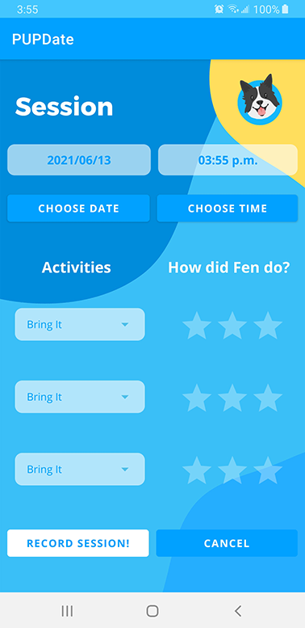
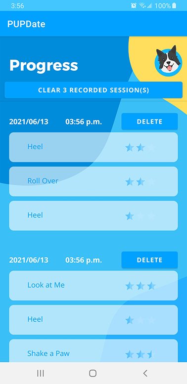

# PupDate 
A mobile app for scheduling, recording and tracking daily training sessions with your puppy.

This Java application was built in Android Studio.
Optimized for API 28: Android 9.0 (Pie)+

## Video of Use
https://youtu.be/Wv9V538oRYI

## Screenshots - Portrait Mode  

## Screenshots - Landscape Mode  
  

